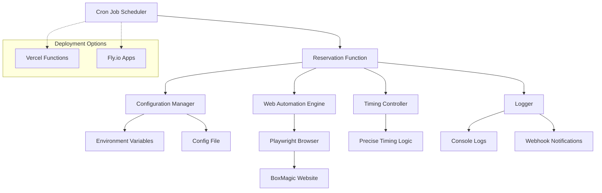
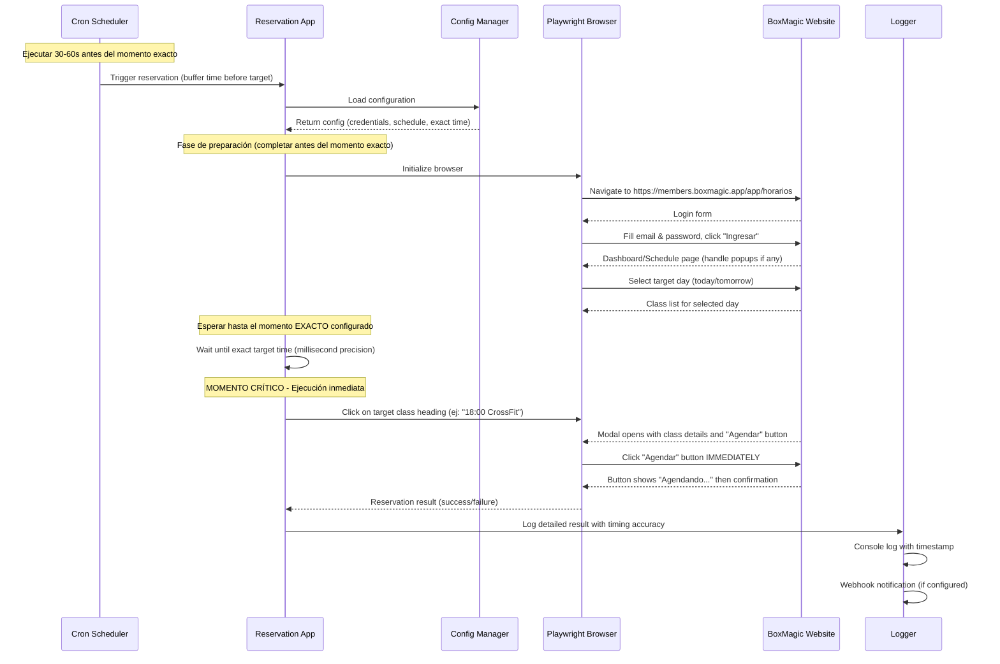

# Documento de Diseño

## Visión General

El Bot de Reservas de CrossFit es una aplicación Node.js que utiliza Playwright para automatización web y se despliega como una función serverless con capacidades de cron jobs. El sistema está diseñado para manejar timing crítico (milisegundos) y ejecutar reservas automáticas exactamente cuando los cupos se abren en BoxMagic.

La arquitectura prioriza la precisión temporal, la confiabilidad y la simplicidad operacional, siendo un MVP personal que puede escalar a múltiples usuarios en el futuro.

## Arquitectura

### Arquitectura de Alto Nivel



### Flujo de Ejecución Principal



## Componentes e Interfaces

### 1. Configuration Manager
**Responsabilidad:** Gestionar configuración externa y credenciales

La aplicación leerá la configuración de múltiples fuentes en orden de prioridad:

1. **Variables de entorno** (para credenciales y configuración básica)
2. **Archivo JSON de configuración** (para horarios y clases específicas)
3. **Parámetros de función** (para ejecución específica vía cron)

```typescript
interface ReservationConfig {
  credentials: {
    email: string;        // Desde BOXMAGIC_EMAIL
    password: string;     // Desde BOXMAGIC_PASSWORD
  };
  schedules: ReservationSchedule[];  // Desde config.json o variables de entorno
  notifications: {
    webhookUrl?: string;  // Desde WEBHOOK_URL (opcional - para implementar en el futuro)
    enabled: boolean;     // Default: false hasta que configures el webhook
  };
  timezone: string;       // Desde TIMEZONE o default 'America/Santiago'
}

interface ReservationSchedule {
  id: string;                    // Identificador único
  dayToSelect: 'today' | 'tomorrow';  // Día a seleccionar en el sitio (siempre "tomorrow" por regla 25h)
  className: string;             // Nombre exacto de la clase (ej: "METCON", "18:00 CrossFit")
  reservationTime: string;       // Momento EXACTO cuando se abre la reserva (ISO datetime)
  bufferSeconds: number;         // Tiempo de preparación antes del momento exacto (default: 30)
  enabled: boolean;              // Si esta reserva está activa
  cronExpression?: string;       // Expresión cron para scheduling automático
  description?: string;          // Descripción legible para el usuario
}
```

### Lógica de Timing de 25 Horas (Regla de BoxMagic)

**Regla Fundamental:** Las reservas se abren exactamente 25 horas antes del inicio de la clase.

**Implicaciones:**
- **SIEMPRE reservamos para "mañana"** (dayToSelect: "tomorrow")
- **El timing es crítico** porque todos compiten por los cupos en el mismo momento
- **No hay cálculos automáticos** - todos los horarios se configuran manualmente

**Ejemplos Reales:**
```
Clase: METCON Viernes 18:00
├── Apertura de reservas: Jueves 17:00:00.000
├── Día a seleccionar en el sitio: "VIE. 12" (mañana)
└── Configuración: dayToSelect: "tomorrow"

Clase: CrossFit Lunes 18:00  
├── Apertura de reservas: Domingo 17:00:00.000
├── Día a seleccionar en el sitio: "LUN. 15" (mañana)
└── Configuración: dayToSelect: "tomorrow"
```

### Fuentes de Configuración Específicas:

**Variables de Entorno (Obligatorias):**
```bash
BOXMAGIC_EMAIL=gtcarvacho@gmail.com
BOXMAGIC_PASSWORD=manada
```

**Variables de Entorno (Opcionales):**
```bash
TIMEZONE=America/Santiago
WEBHOOK_URL=https://hooks.zapier.com/...  # Opcional - para implementar más adelante
BROWSER_HEADLESS=true
NOTIFICATIONS_ENABLED=false  # Default: false hasta configurar webhook
```

**Archivo config.json (Ejemplo Real):**
```json
{
  "schedules": [
    {
      "id": "metcon-viernes-18",
      "dayToSelect": "tomorrow",
      "className": "METCON",
      "reservationTime": "2024-09-19T17:00:00-03:00",
      "bufferSeconds": 30,
      "enabled": true,
      "cronExpression": "0 17 * * 4",
      "description": "Reservar METCON del viernes 18:00 (se abre jueves 17:00)"
    },
    {
      "id": "crossfit-lunes-18",
      "dayToSelect": "tomorrow", 
      "className": "18:00 CrossFit",
      "reservationTime": "2024-09-22T17:00:00-03:00",
      "bufferSeconds": 30,
      "enabled": true,
      "cronExpression": "0 17 * * 0",
      "description": "Reservar CrossFit del lunes 18:00 (se abre domingo 17:00)"
    },
    {
      "id": "crossfit-martes-19",
      "dayToSelect": "tomorrow",
      "className": "19:00 CrossFit", 
      "reservationTime": "2024-09-23T18:00:00-03:00",
      "bufferSeconds": 30,
      "enabled": true,
      "cronExpression": "0 18 * * 1",
      "description": "Reservar CrossFit del martes 19:00 (se abre lunes 18:00)"
    }
  ]
}
```

**Lógica de Configuración Explicada:**

- **reservationTime**: El momento EXACTO cuando se abre la reserva (25 horas antes de la clase)
- **dayToSelect**: Siempre será "tomorrow" porque reservamos para el día siguiente
- **className**: Nombre exacto como aparece en el sitio ("METCON", "18:00 CrossFit", etc.)
- **cronExpression**: Cuándo ejecutar el cron (día y hora de apertura de reservas)

**Ejemplos de Timing Real:**
- Clase METCON viernes 18:00 → Reserva se abre jueves 17:00 → dayToSelect: "tomorrow"
- Clase CrossFit lunes 18:00 → Reserva se abre domingo 17:00 → dayToSelect: "tomorrow"

**Parámetros de Función (Para cron específico):**
```typescript
// La función puede recibir parámetros específicos para una reserva
interface FunctionParams {
  scheduleId?: string;     // ID específico de la reserva a ejecutar
  className?: string;      // Override del nombre de clase
  targetTime?: string;     // Override del tiempo objetivo
}
```

### 2. Web Automation Engine
**Responsabilidad:** Manejar toda la interacción con el navegador web

```typescript
interface WebAutomationEngine {
  initialize(): Promise<void>;
  login(email: string, password: string): Promise<boolean>;
  navigateToSchedule(): Promise<void>;
  selectDay(dayToSelect: 'today' | 'tomorrow'): Promise<void>;
  waitUntilReady(): Promise<void>; // Esperar hasta estar listo para el momento exacto
  executeReservation(className: string): Promise<ReservationResult>; // Acción crítica de timing
  handlePopups(): Promise<void>;
  cleanup(): Promise<void>;
}

interface ReservationResult {
  success: boolean;
  message: string;
  timestamp: Date;
  timingAccuracy: number; // milisegundos de diferencia del tiempo objetivo
  hasSpots: boolean;
  participantCount?: string; // ej: "5/15"
  classStatus: 'available' | 'full' | 'already_booked';
}

// Selectores específicos basados en la exploración real
const SELECTORS = {
  login: {
    email: 'textbox[name="Correo"]',
    password: 'textbox[placeholder="Contraseña"]',
    submitButton: 'text=Ingresar'
  },
  navigation: {
    // Selectores dinámicos basados en la imagen observada
    daySelector: (day: string) => `text=${day}.`, // ej: "jue.", "vie."
    dayNumber: (number: string) => `text=${number}`, // ej: "11", "12"
    alternativeButton: 'text=Hoy' // o 'text=Mañana'
  },
  classes: {
    classHeading: (className: string) => `heading:has-text("${className}")`,
    availableSpaces: 'text=Espacios disponibles',
    fullCapacity: 'text=Capacidad completa',
    alreadyBooked: 'text=Agendada'
  },
  modal: {
    reserveButton: 'text=Agendar',
    reservingButton: 'text=Agendando',
    closeButton: 'button:first-child',
    participantInfo: 'text=Participantes'
  }
};
```

### 3. Timing Controller
**Responsabilidad:** Manejar la precisión temporal crítica

```typescript
interface TimingController {
  calculatePreparationTime(targetTime: Date, bufferSeconds: number): Date;
  waitUntilExactTime(targetTime: Date): Promise<void>;
  getCurrentTime(): Date;
  getTimeDifference(target: Date, current: Date): number;
  measureExecutionTime<T>(operation: () => Promise<T>): Promise<{ result: T; duration: number }>;
}

// Estrategia de timing crítico
class PrecisionTiming {
  // Fase 1: Preparación (30-60 segundos antes)
  async prepareForReservation(targetTime: Date): Promise<void> {
    const preparationTime = new Date(targetTime.getTime() - 30000); // 30s antes
    await this.waitUntilExactTime(preparationTime);
  }
  
  // Fase 2: Espera precisa hasta el momento exacto
  async waitForExactMoment(targetTime: Date): Promise<void> {
    const now = new Date();
    const waitTime = targetTime.getTime() - now.getTime();
    
    if (waitTime > 1000) {
      // Espera gruesa hasta 1 segundo antes
      await new Promise(resolve => setTimeout(resolve, waitTime - 1000));
    }
    
    // Espera precisa con polling de alta frecuencia
    while (new Date().getTime() < targetTime.getTime()) {
      await new Promise(resolve => setTimeout(resolve, 1)); // 1ms polling
    }
  }
  
  // Fase 3: Ejecución inmediata
  async executeAtExactTime<T>(operation: () => Promise<T>): Promise<{ result: T; accuracy: number }> {
    const startTime = new Date();
    const result = await operation();
    const endTime = new Date();
    
    return {
      result,
      accuracy: endTime.getTime() - startTime.getTime()
    };
  }
}
```

### 4. Logger
**Responsabilidad:** Registro de eventos y notificaciones

```typescript
interface Logger {
  logInfo(message: string, metadata?: object): void;
  logError(error: Error, metadata?: object): void;
  logReservationAttempt(config: ReservationConfig): void;
  logReservationResult(result: ReservationResult): void;
  sendWebhookNotification?(result: ReservationResult): Promise<void>; // Opcional - implementar más adelante
}
```

## Modelos de Datos

### Configuración de Reserva
```typescript
type ReservationSchedule = {
  id: string;
  day: 'today' | 'tomorrow';
  className: string;
  reservationTime: string; // ISO datetime string
  bufferSeconds: number;
  enabled: boolean;
};

type AppConfig = {
  credentials: {
    email: string;
    password: string;
  };
  schedules: ReservationSchedule[];
  notifications: {
    webhookUrl?: string;
    enabled: boolean;
  };
  browser: {
    headless: boolean;
    timeout: number;
  };
  timezone: string;
};
```

### Resultado de Ejecución
```typescript
type ExecutionResult = {
  scheduleId: string;
  startTime: Date;
  endTime: Date;
  success: boolean;
  error?: string;
  reservationResult?: ReservationResult;
  timingAccuracy: number; // milliseconds difference from target
};
```

## Timing Crítico - Implementación Detallada

### Flujo de Timing Observado en BoxMagic

Basado en la exploración real del sitio, el flujo crítico es:

1. **Preparación (completar 5-10s antes del momento exacto):**
   - Login completado
   - Día seleccionado
   - Lista de clases visible
   - Clase objetivo identificada y verificada

2. **Momento Exacto (precisión de milisegundos):**
   - Click en heading de la clase → Modal se abre con botón "Agendar"
   - Click inmediato en "Agendar" → Botón cambia a "Agendando"
   - Confirmación automática → Clase muestra "Agendada"

### Implementación de Precisión Temporal

```typescript
class CriticalTimingExecution {
  async executeAtPreciseTime(targetTime: Date, className: string): Promise<ReservationResult> {
    // Espera hasta 100ms antes del momento exacto
    await this.waitUntil(new Date(targetTime.getTime() - 100));
    
    // Preparar selectores para ejecución inmediata
    const classSelector = `heading:has-text("${className}")`;
    const reserveSelector = 'text=Agendar';
    
    // Polling de alta frecuencia hasta el momento exacto
    while (new Date().getTime() < targetTime.getTime()) {
      await new Promise(resolve => setTimeout(resolve, 1));
    }
    
    // EJECUCIÓN CRÍTICA - Sin await entre acciones para máxima velocidad
    const executionStart = new Date();
    
    // Acción 1: Abrir clase
    const classClickPromise = page.click(classSelector);
    
    // Acción 2: Esperar modal y click en Agendar (en paralelo)
    const reservePromise = page.waitForSelector(reserveSelector, { timeout: 2000 })
      .then(() => page.click(reserveSelector));
    
    await Promise.all([classClickPromise, reservePromise]);
    
    const executionEnd = new Date();
    
    // Verificar resultado
    const success = await this.verifyReservationSuccess();
    
    return {
      success,
      timingAccuracy: executionEnd.getTime() - executionStart.getTime(),
      targetAccuracy: executionStart.getTime() - targetTime.getTime(),
      timestamp: executionStart
    };
  }
  
  async verifyReservationSuccess(): Promise<boolean> {
    try {
      // Buscar indicadores de éxito observados
      await page.waitForSelector('text=Agendada', { timeout: 3000 });
      return true;
    } catch {
      // Verificar si hay mensaje de error o capacidad completa
      const hasError = await page.locator('text=Capacidad completa').isVisible();
      return !hasError;
    }
  }
}
```

## Manejo de Errores

### Estrategia de Reintentos Específica para Timing Crítico
- **Fallo de timing crítico:** NO reintento (momento perdido)
- **Fallo de preparación:** 1 reintento si hay tiempo suficiente
- **Elemento no encontrado en preparación:** 1 reintento después de 2 segundos
- **Sin cupos disponibles:** No reintento, log como información

### Tipos de Error Específicos
```typescript
enum ErrorType {
  NETWORK_ERROR = 'network_error',
  LOGIN_FAILED = 'login_failed',
  CLASS_NOT_FOUND = 'class_not_found',
  NO_SPOTS_AVAILABLE = 'no_spots_available',
  TIMING_ERROR = 'timing_error',
  BROWSER_ERROR = 'browser_error',
  PREPARATION_TIMEOUT = 'preparation_timeout',
  MODAL_NOT_OPENED = 'modal_not_opened',
  RESERVE_BUTTON_NOT_FOUND = 'reserve_button_not_found'
}
```

### Casos Edge Específicos Observados
- **Popup informativo después del login:** Detectar y cerrar con botón OK o X
- **Clase ya agendada:** Detectar estado "Agendada" y reportar como éxito
- **Capacidad completa:** Detectar "Capacidad completa" antes del momento crítico
- **Modal no se abre:** Timeout de 2 segundos máximo para apertura de modal
- **Cambio de día automático:** Verificar que estamos en el día correcto antes de ejecutar

## Estrategia de Testing

### Testing Unitario
- **Configuration Manager:** Validación de configuración
- **Timing Controller:** Precisión de cálculos temporales
- **Logger:** Formato y envío de logs

### Testing de Integración
- **Web Automation Engine:** Flujo completo de navegación (con sitio de prueba)
- **End-to-end:** Simulación completa sin reserva real

### Testing Manual
- **Timing Accuracy:** Verificación de precisión temporal en entorno real
- **Error Scenarios:** Pruebas con credenciales incorrectas, clases inexistentes

### Estrategia de Testing en Producción
```typescript
// Modo de prueba que no ejecuta la reserva final
interface TestMode {
  enabled: boolean;
  stopBeforeReservation: boolean;
  logTimingAccuracy: boolean;
}
```

## Estrategia de Despliegue

### Enfoque Recomendado: Vercel como Prioridad Principal

**Decisión de Arquitectura:** Implementaremos **Vercel Functions como opción principal** con **Fly.io como alternativa de respaldo**. Esto permite:

1. **Desarrollo inicial rápido** en Vercel (más simple)
2. **Migración a Fly.io** si se requiere más control o mejor latencia
3. **Código compatible** entre ambas plataformas

### Implementación Unificada

```typescript
// Estructura de proyecto compatible con ambas plataformas
src/
├── core/           // Lógica principal (independiente de plataforma)
├── handlers/       // Adaptadores específicos por plataforma
│   ├── vercel.ts   // Handler para Vercel Functions
│   └── flyio.ts    // Handler para Fly.io
└── config/         // Configuración por entorno
```

### Opción 1: Vercel Functions (Implementación Principal)

**Ventajas para nuestro caso:**
- Setup inicial más rápido
- Cron jobs integrados
- Variables de entorno simples
- Despliegue automático desde Git

## Estrategias de Activación Automática

### Opción 1: Cron Jobs Individuales (Recomendado para inicio)

Cada reserva tiene su propio cron job que se ejecuta automáticamente:

**Configuración Vercel:**
```json
// vercel.json
{
  "functions": {
    "api/reserve.js": {
      "maxDuration": 60
    }
  },
  "crons": [
    {
      "path": "/api/reserve?scheduleId=metcon-viernes-18",
      "schedule": "0 17 * * 4"
    },
    {
      "path": "/api/reserve?scheduleId=crossfit-lunes-18",
      "schedule": "0 17 * * 0"
    },
    {
      "path": "/api/reserve?scheduleId=crossfit-martes-19",
      "schedule": "0 18 * * 1"
    },
    {
      "path": "/api/reserve?scheduleId=crossfit-miercoles-18",
      "schedule": "0 17 * * 2"
    },
    {
      "path": "/api/reserve?scheduleId=crossfit-jueves-19",
      "schedule": "0 18 * * 3"
    },
    {
      "path": "/api/reserve?scheduleId=crossfit-sabado-10",
      "schedule": "0 9 * * 5"
    }
  ],
  "env": {
    "BOXMAGIC_EMAIL": "@boxmagic_email",
    "BOXMAGIC_PASSWORD": "@boxmagic_password"
  }
}
```

**Ventajas:**
- Cada reserva es independiente
- Si una falla, las otras siguen funcionando
- Fácil de configurar y entender
- Perfecto para rutina semanal consistente

### Opción 2: Cron Job Inteligente (Más avanzado)

Un solo cron que se ejecuta frecuentemente y decide qué hacer:

```json
// vercel.json
{
  "crons": [
    {
      "path": "/api/scheduler",
      "schedule": "*/5 * * * *"
    }
  ]
}
```

```typescript
// api/scheduler.js - Se ejecuta cada 5 minutos
export default async function scheduler(req, res) {
  const now = new Date();
  const config = await loadConfig();
  
  // Buscar reservas que deben ejecutarse en los próximos 5 minutos
  const upcomingReservations = config.schedules.filter(schedule => {
    if (!schedule.enabled) return false;
    
    const reservationTime = new Date(schedule.reservationTime);
    const timeDiff = reservationTime.getTime() - now.getTime();
    return timeDiff > 0 && timeDiff <= 5 * 60 * 1000; // 5 minutos
  });
  
  for (const reservation of upcomingReservations) {
    // Ejecutar cada reserva en su momento exacto
    await scheduleReservation(reservation);
  }
  
  res.json({ 
    checked: now.toISOString(),
    upcoming: upcomingReservations.length 
  });
}
```

**Ventajas:**
- Más flexible para cambios de horario
- Un solo punto de control
- Mejor para horarios variables

### Opción 3: Servicios Externos de Cron

Usar servicios como **cron-job.org** o **GitHub Actions**:

```yaml
# .github/workflows/reservations.yml
name: CrossFit Reservations
on:
  schedule:
    - cron: '0 17 * * 0'  # Domingo 17:00 para clase lunes
    - cron: '0 18 * * 1'  # Lunes 18:00 para clase martes
    - cron: '0 17 * * 2'  # Martes 17:00 para clase miércoles
    - cron: '0 18 * * 3'  # Miércoles 18:00 para clase jueves
    - cron: '0 17 * * 4'  # Jueves 17:00 para clase viernes
    - cron: '0 9 * * 5'   # Viernes 09:00 para clase sábado

jobs:
  reserve:
    runs-on: ubuntu-latest
    steps:
      - name: Trigger Reservation
        run: |
          curl -X POST "https://tu-app.vercel.app/api/reserve" \
            -H "Authorization: Bearer ${{ secrets.API_KEY }}"
```

### Recomendación para tu Caso

**Para empezar: Opción 1 (Cron Jobs Individuales)**

Porque:
- Tienes una rutina semanal consistente (lunes a sábado)
- Cada clase tiene su horario fijo
- Es más simple de configurar y debuggear
- Si una reserva falla, no afecta las otras

**Handler Vercel:**
```typescript
// api/reserve.js
import { ReservationBot } from '../src/core/ReservationBot';

export default async function handler(req, res) {
  const { scheduleId } = req.query;
  
  try {
    const bot = new ReservationBot();
    const result = await bot.executeReservation(scheduleId);
    
    res.status(200).json({ success: true, result });
  } catch (error) {
    res.status(500).json({ success: false, error: error.message });
  }
}
```

### Opción 2: Fly.io (Alternativa de Respaldo)

**Cuándo usar Fly.io:**
- Si Vercel tiene problemas de latencia desde Chile
- Si necesitamos más control sobre el timing
- Si requerimos ejecución más larga (>60 segundos)

**Configuración Fly.io:**
```toml
# fly.toml
app = "crossfit-reservation-bot"
primary_region = "scl"  # Santiago, Chile para menor latencia

[build]
  image = "node:18-alpine"

[env]
  NODE_ENV = "production"
  TIMEZONE = "America/Santiago"

[[services]]
  internal_port = 3000
  protocol = "tcp"

[processes]
  web = "node dist/handlers/flyio.js"
```

**Dockerfile para Fly.io:**
```dockerfile
FROM node:18-alpine
WORKDIR /app
COPY package*.json ./
RUN npm ci --only=production
COPY dist/ ./dist/
EXPOSE 3000
CMD ["node", "dist/handlers/flyio.js"]
```

### Configuración de Cron Jobs por Plataforma

**Vercel (Recomendado para inicio):**
- Cron jobs nativos en `vercel.json`
- Cada cron llama a la función con `scheduleId` específico
- Configuración simple y visual en dashboard

**Fly.io (Para casos avanzados):**
- Cron jobs externos (GitHub Actions, cron-job.org, etc.)
- O implementación interna con node-cron
- Mayor flexibilidad pero más configuración

### Variables de Entorno por Plataforma

**Vercel:**
```bash
# En Vercel Dashboard o vercel.json
BOXMAGIC_EMAIL=gtcarvacho@gmail.com
BOXMAGIC_PASSWORD=manada
TIMEZONE=America/Santiago
WEBHOOK_URL=https://hooks.zapier.com/...
```

**Fly.io:**
```bash
# Via fly secrets
fly secrets set BOXMAGIC_EMAIL=gtcarvacho@gmail.com
fly secrets set BOXMAGIC_PASSWORD=manada
fly secrets set WEBHOOK_URL=https://hooks.zapier.com/...
```

### Plan de Migración

1. **Fase 1:** Desarrollar e implementar en Vercel
2. **Fase 2:** Probar timing y latencia en producción
3. **Fase 3:** Si es necesario, migrar a Fly.io manteniendo el mismo código core

### Variables de Entorno Requeridas
```bash
# Credenciales
BOXMAGIC_EMAIL=gtcarvacho@gmail.com
BOXMAGIC_PASSWORD=manad

# Configuración
TIMEZONE=America/Santiago
WEBHOOK_URL=https://hooks.zapier.com/...

# Configuración de Browser
BROWSER_HEADLESS=true
BROWSER_TIMEOUT=30000

# Configuración de Deployment
NODE_ENV=production
```

## Consideraciones de Seguridad

### Protección de Credenciales
- Variables de entorno para credenciales sensibles
- No logging de passwords
- Rotación periódica recomendada

### Rate Limiting
- Máximo 2 reservas por día
- Cooldown entre intentos fallidos
- Detección de comportamiento anómalo del sitio

### Monitoreo
- Logs de todos los intentos de acceso
- Alertas por fallos consecutivos
- Métricas de timing y éxito

## Optimizaciones de Performance

### Timing Crítico - Estrategia de Dos Fases

**Fase 1: Preparación (30-60s antes del momento exacto)**
```typescript
async prepareReservation(config: ReservationConfig): Promise<void> {
  // 1. Login y navegación
  await this.webEngine.login(config.credentials.email, config.credentials.password);
  await this.webEngine.handlePopups(); // Manejar popups informativos
  
  // 2. Seleccionar día objetivo (siempre "tomorrow" por regla 25h)
  await this.webEngine.selectDay(config.schedule.dayToSelect);
  
  // 3. Verificar que la clase existe y tiene espacios
  const classStatus = await this.webEngine.checkClassStatus(config.schedule.className);
  if (classStatus === 'full' || classStatus === 'already_booked') {
    throw new Error(`Class ${config.schedule.className} is ${classStatus}`);
  }
  
  // 4. Posicionar el navegador listo para el click
  await this.webEngine.waitUntilReady();
}
```

**Fase 2: Ejecución Crítica (momento exacto)**
```typescript
async executeReservation(className: string): Promise<ReservationResult> {
  const startTime = new Date();
  
  // Acción 1: Abrir clase (esto hace aparecer el modal con botón "Agendar")
  await page.click(`heading:has-text("${className}")`);
  
  // Acción 2: Click inmediato en "Agendar" (sin esperas adicionales)
  await page.click('text=Agendar');
  
  // Acción 3: Verificar resultado
  const result = await this.verifyReservationResult();
  
  return {
    ...result,
    timingAccuracy: new Date().getTime() - startTime.getTime()
  };
}
```

### Optimizaciones de Velocidad
- **Navegador pre-calentado**: Mantener contexto de navegador activo
- **Selectores optimizados**: Usar selectores específicos observados en la exploración
- **Sin esperas innecesarias**: Eliminar `waitForSelector` en la fase crítica
- **JavaScript directo**: Usar `page.evaluate()` para clicks más rápidos si es necesario

```typescript
const browserConfig = {
  headless: true,
  args: [
    '--no-sandbox',
    '--disable-setuid-sandbox',
    '--disable-dev-shm-usage',
    '--disable-web-security',
    '--disable-features=VizDisplayCompositor',
    '--disable-background-networking',
    '--disable-background-timer-throttling',
    '--disable-renderer-backgrounding',
    '--disable-backgrounding-occluded-windows'
  ]
};

// Configuración de página optimizada para velocidad
const pageConfig = {
  timeout: 5000, // Timeout reducido para preparación
  waitUntil: 'domcontentloaded' // No esperar recursos adicionales
};
```

### Medición de Precisión
```typescript
interface TimingMetrics {
  preparationDuration: number; // Tiempo total de preparación
  executionDuration: number;   // Tiempo de ejecución crítica
  targetAccuracy: number;      // Diferencia del tiempo objetivo (ms)
  totalDuration: number;       // Tiempo total del proceso
}
```