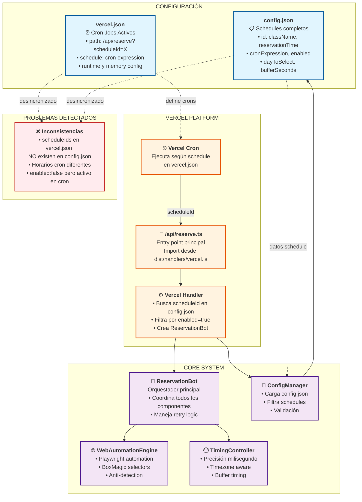
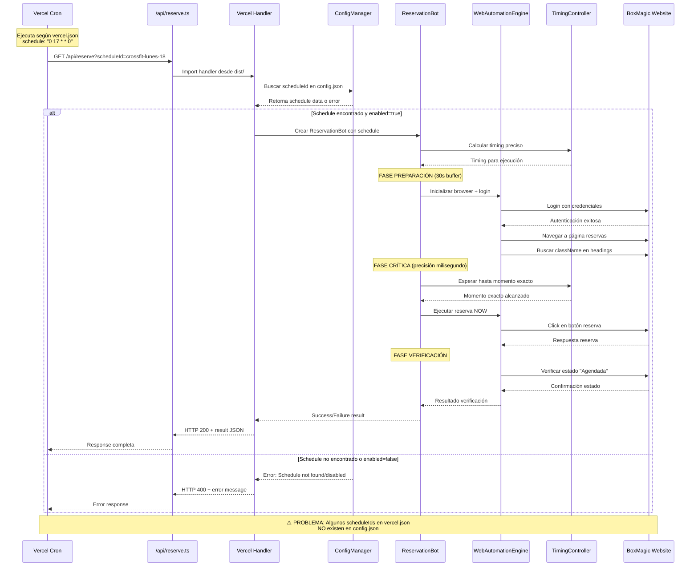
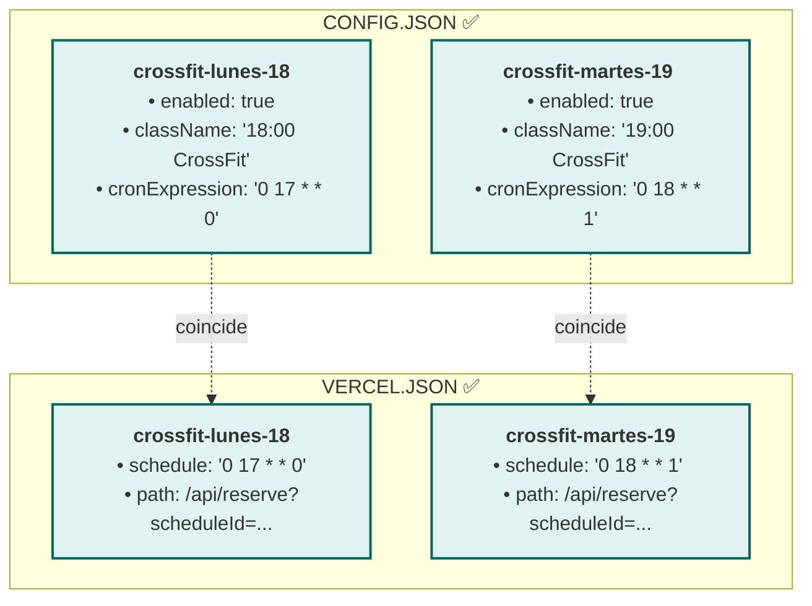
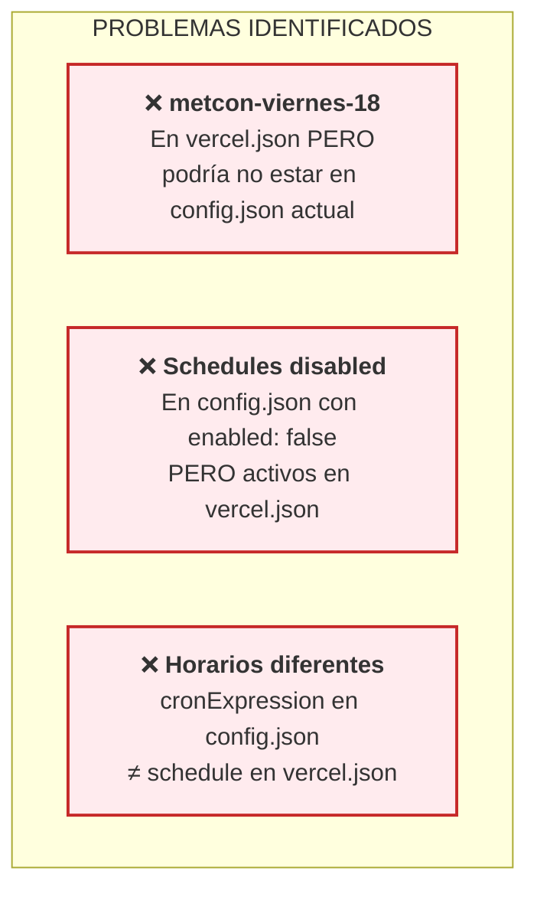

# ANÁLISIS COMPLETO: Sistema de Reservas CrossFit

## 🎯 TU PREGUNTA PRINCIPAL

**"¿Cómo funciona exactamente el sistema en Vercel? ¿Debo configurar cada ID en vercel.json Y TAMBIÉN en config.json?"**

**RESPUESTA DIRECTA: SÍ, debes configurar en AMBOS archivos, pero son configuraciones DIFERENTES que deben estar SINCRONIZADAS.**

---

## 📋 RESUMEN EJECUTIVO

Tu sistema funciona con **DOS archivos de configuración independientes** que deben mantenerse sincronizados manualmente:

1. **`config.json`** → Contiene los datos COMPLETOS de cada reserva (className, horarios, etc.)
2. **`vercel.json`** → Contiene los cron jobs que ACTIVAN cada reserva con el scheduleId

### El Problema Principal Identificado
❌ **FALTA SINCRONIZACIÓN**: Hay scheduleIds en `vercel.json` que no existen en `config.json`, y viceversa.

---

## 🏗️ ARQUITECTURA GENERAL



---

## 🔄 FLUJO COMPLETO PASO A PASO



---

## ⚙️ CONFIGURACIÓN: DOS ARCHIVOS, DOS PROPÓSITOS

### 📋 config.json - Datos Completos de Reservas

```json
{
  "schedules": [
    {
      "id": "crossfit-lunes-18",                    // ← ID usado en vercel.json
      "dayToSelect": "tomorrow",                    // ← Usado por WebAutomationEngine
      "className": "18:00 CrossFit",               // ← Texto exacto a buscar en BoxMagic
      "reservationHour": "22:00",                  // ← Hora exacta de reserva
      "reservationDay": "sunday",                  // ← Día de la semana
      "bufferSeconds": 30,                         // ← Buffer de preparación
      "enabled": true,                             // ← Switch on/off
      "cronExpression": "0 18 * * 0",             // ← Para referencia
      "description": "CrossFit Lunes 18:00"
    }
  ]
}
```

**Propósito**: Contiene TODOS los datos necesarios para ejecutar la reserva.

### ⏰ vercel.json - Activación Automática

```json
{
  "crons": [
    {
      "path": "/api/reserve?scheduleId=crossfit-lunes-18",  // ← Debe coincidir con config.json
      "schedule": "0 17 * * 0"                             // ← Cuándo ejecutar
    }
  ]
}
```

**Propósito**: Define CUÁNDO Vercel debe ejecutar cada reserva.

---

## 🔍 ANÁLISIS DE TU CONFIGURACIÓN ACTUAL

### ✅ Lo que ESTÁ funcionando correctamente:



### ⚠️ Problemas DETECTADOS:



---

## 🛠️ CÓMO CONFIGURAR CORRECTAMENTE

### Paso 1: Agregar una nueva reserva

**1.1 En config.json:**
```json
{
  "id": "crossfit-miercoles-19",           // ← Crear ID único
  "dayToSelect": "tomorrow",
  "className": "19:00 CrossFit",           // ← Texto EXACTO en BoxMagic
  "reservationHour": "19:00",              // ← Hora exacta
  "reservationDay": "tuesday",             // ← Día anterior a la clase
  "bufferSeconds": 30,
  "enabled": true,                         // ← IMPORTANTE: true para activar
  "cronExpression": "0 19 * * 2",         // ← Para referencia
  "description": "CrossFit Miércoles 19:00"
}
```

**1.2 En vercel.json:**
```json
{
  "path": "/api/reserve?scheduleId=crossfit-miercoles-19",  // ← MISMO ID
  "schedule": "0 19 * * 2"                                 // ← MISMO horario cron
}
```

### Paso 2: Verificar sincronización

```bash
# Verificar que la configuración es válida
curl "https://tu-app.vercel.app/api/reserve?validate=true"

# Probar un schedule específico
curl "https://tu-app.vercel.app/api/reserve?scheduleId=crossfit-miercoles-19"
```

---

## ⏱️ TIMING DE EJECUCIÓN

```mermaid
gantt
    title Flujo Temporal de Reserva CrossFit (25-hour rule)
    dateFormat HH:mm:ss
    axisFormat %H:%M:%S
    
    section Preparación (30s buffer)
    Login y autenticación    :prep1, 16:59:30, 16:59:40
    Navegación a reservas    :prep2, after prep1, 16:59:45
    Búsqueda de className    :prep3, after prep2, 16:59:50
    Posicionamiento final    :prep4, after prep3, 16:59:58
    
    section Ejecución Crítica (1ms precision)
    Espera momento exacto    :crit, 16:59:58, 17:00:00
    Click reserva            :active, 17:00:00, 17:00:00
    
    section Verificación
    Confirmar "Agendada"     :verify1, 17:00:00, 17:00:02
    Logging resultado        :verify2, after verify1, 17:00:03
    Cleanup y cierre         :verify3, after verify2, 17:00:05
```

---

## 🚨 CHECKLIST DE CONFIGURACIÓN

### ✅ Antes de deployar a Vercel:

- [ ] **Todos los scheduleIds en vercel.json existen en config.json**
- [ ] **Todos los schedules tienen enabled: true si están en vercel.json**
- [ ] **Los horarios cron coinciden entre ambos archivos**
- [ ] **Las classNames coinciden EXACTAMENTE con BoxMagic**
- [ ] **Las variables de entorno están configuradas en Vercel**
- [ ] **La build funciona correctamente: `npm run build`**

### 🔧 Variables de entorno requeridas en Vercel:

```bash
BOXMAGIC_EMAIL=tu-email@example.com
BOXMAGIC_PASSWORD=tu-password
WEBHOOK_URL=https://tu-webhook-endpoint
TIMEZONE=America/Santiago
BROWSER_HEADLESS=true
NOTIFICATIONS_ENABLED=true
```

---

## 🎯 RESPUESTA A TUS PREGUNTAS ESPECÍFICAS

### ❓ "¿Cómo funcionará en Vercel?"

1. **Vercel ejecuta cron jobs** según `vercel.json`
2. **Cada cron llama** a `/api/reserve?scheduleId=X`
3. **El handler busca** el scheduleId en `config.json`
4. **Si existe y enabled=true**, ejecuta la reserva
5. **Si no existe o enabled=false**, devuelve error

### ❓ "¿Debo configurar cada ID en vercel.json Y TAMBIÉN en config.json?"

**SÍ, pero con propósitos diferentes:**

- **config.json**: Datos completos del schedule (className, timing, etc.)
- **vercel.json**: Cuándo activar ese schedule específico

### ❓ "¿Por qué hay IDs hardcodeados en vercel.json?"

Porque **Vercel cron jobs son estáticos**. No pueden ser dinámicos. Cada cron debe especificar exactamente qué endpoint llamar.

---

## 🛡️ RECOMENDACIONES DE MEJORA

### 1. Script de Validación
Crear un script que verifique sincronización:

```bash
npm run validate-config  # Propuesta para implementar
```

### 2. Generador Automático
Script que genere `vercel.json` desde `config.json`:

```bash
npm run generate-vercel  # Propuesta para implementar  
```

### 3. Webhook de Monitoreo
Configurar notificaciones para detectar inconsistencias.

---

## 📝 CONCLUSIÓN

Tu sistema está **funcionalmente correcto** pero requiere **sincronización manual** entre dos archivos de configuración. En modo desarrollo funciona perfecto porque usa directamente `config.json`, pero en Vercel necesitas mantener ambos archivos alineados.

**La clave es entender que son DOS SISTEMAS:**
1. **Vercel cron** (cuándo ejecutar)
2. **Config schedules** (qué ejecutar)

Ambos deben apuntar al mismo scheduleId para que funcione correctamente.